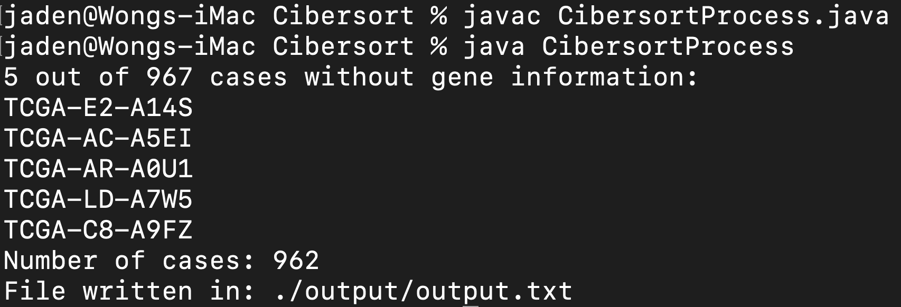

# CS4220
Members: Mani Hema Prashaad, Wang Yiteng, Wong Jun Hong, Yang Xinyi.

## Table of Content

* [Isolation of Breast Cancer Related Genes' Expression](#Isolation-of-Breast-Cancer-Related-Genes-Expression)
* [Cibersort](#Cibersort)
* [Cox Analysis](#Cox-Analysis)
* [Random Survival Forest (RSF)](#RSF)
* [Generation of Means Comparison Graphs](#Generation-of-Means-Comparison-Graphs)

## Isolation of Breast Cancer Related Genes Expression

* [Isolation of prognostic gene expression.ipynb](https://github.com/jadenwjh/CS4220/blob/main/Isolation%20of%20Breast%20Cancer%20Related%20Genes'%20Expression/Isolation%20of%20prognostic%20gene%20expression.ipynb)
    * Extracts the FPKM values for the genes-of-interest after filtering for the primary tumour samples' RNAseq data files for each case.

* [Datasets](https://github.com/jadenwjh/CS4220/tree/main/Isolation%20of%20Breast%20Cancer%20Related%20Genes'%20Expression/datasets)
    * FPKM data of the patients, pulled from GDC.

## Cibersort

* [CibersortProcess.java](https://github.com/jadenwjh/CS4220/blob/main/Cibersort/CibersortProcess.java)
    * Executed to generate the mixture file to be sent to CIBERSORT.
    * Also determines the cases without FPKM data (GDC does not have FPKM records of these patients).

* [filtered_cases.txt](https://github.com/jadenwjh/CS4220/blob/main/Cibersort/filtered_cases.txt)
    * Contains the 967 cases-of-interest after dropping cases or imputation (from 1098 cases).

* [Manifest](https://github.com/jadenwjh/CS4220/blob/main/Cibersort/MANIFEST.txt)
    * Contains the file IDs of all files pulled from GDC.

* [File to case ID mapping](https://github.com/jadenwjh/CS4220/tree/main/Cibersort/file_case_mapping)
    * `MANIFEST.txt` file does not include the case ID of each dataset.
    * Using a scrapped JSON, these file IDs were mapped to their respective Case IDs.

* [Gene mapping](https://github.com/jadenwjh/CS4220/tree/main/Cibersort/gene_mapping)
    * GDC FPKM files uses the ENSEMBL gene symbols which were incompatible with CIBERSORT's LM22 signature matrix, which required HUGO symbols.
    * Maps the ENSEMBL symbols to HUGO symbols.

* [Mixture file](https://github.com/jadenwjh/CS4220/tree/main/Cibersort/output/output.txt)
    * The output mixture file after executing `CibersortProcess.java`.
    * Uploaded to CIBERSORT.

* [Cibersort Output file](https://github.com/jadenwjh/CS4220/tree/main/Cibersort/CIBERSORT.Output_Job4.csv)
    * Output from CIBERSORT after 100 permutations were ran, using LM22 and mixture file.
    * Contains the cellular proportion of each case. This was used as a feature for predicting survival.

## Cox Analysis

* [CG_COX](https://github.com/jadenwjh/CS4220/blob/main/Cox%20Analysis/CG_COX.ipynb)
    * Cox and penalized Cox model for a combination of clinical and gene expression data after feature selection.

* [CL_COX](https://github.com/jadenwjh/CS4220/blob/main/Cox%20Analysis/CL_COX.ipynb)
    * Data processing including trimming and imputation for clinical data.
    * Cox and penalized Cox model for only clinical features.

* [CT_COX](https://github.com/jadenwjh/CS4220/blob/main/Cox%20Analysis/CT_COX.ipynb)
    * Cox and penalized Cox model for a combination of clinical and TIIC data after feature selection.

## RSF

* [Clinical features](https://github.com/jadenwjh/CS4220/blob/main/RSF/clinical%20features%2By.csv)
    * Contains the 962 patients' clinical data and survival status.

* [Expression profile of Prognostic genes](https://github.com/jadenwjh/CS4220/blob/main/RSF/prognostic%20genes.csv)
    * Contains the gene expression data of 962 patients with regards to the prognostic genes.

* [Random Survival Forest model](https://github.com/jadenwjh/CS4220/blob/main/RSF/RSF.ipynb)
    * Contains the code for Random Survival Forest model.

## Generation of Means Comparison Graphs

* [Graphing.ipynb](https://github.com/jadenwjh/CS4220/blob/main/Generation%20of%20Means%20Comparison%20Graphs/Graphing.ipynbb)
    * Plots barplots overlaid with scatters of datapoints for the testing and training accuracy metrics for the survival analysis models utilised.